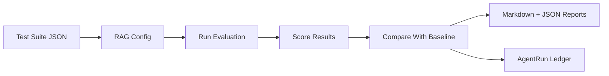

# RAG Regression Lab

RAG Regression Lab is a local-first evaluation harness for RAG apps. It lets you run the same question set against different retrieval/generation configs, score the outputs, detect regressions, and export reports that humans and AI agents can both understand.

RAG apps often break silently. A prompt, chunking, embedding, or retrieval change can improve one answer and damage another. This project makes those quality changes visible before they reach users.

## Features

- Demo SaaS help-center suite with 8 golden test cases.
- Deterministic offline RAG runner: keyword retrieval plus extractive generation.
- Transparent heuristic metrics: expected fact coverage, faithfulness, context precision, answer similarity, and weighted overall score.
- Baseline-vs-candidate comparison with regression, improvement, newly failing, and newly passing statuses.
- Markdown and JSON report export.
- AgentRun Ledger output for agent-readable recovery after resets.
- Vitest coverage for core loading, retrieval, scoring, comparison, reports, and ledger writing.

## Architecture



## Quick Start

```bash
npm install
npm run demo
```

On Windows PowerShell with restricted script execution, use `npm.cmd`:

```powershell
npm.cmd install
npm.cmd run demo
```

The demo command loads `data/demo-suite.json`, runs a baseline config with `top_k=3`, runs a candidate config with `top_k=1`, compares them, writes reports, and updates the AgentRun Ledger.

## CLI Commands

```bash
npm run seed
npm run rag:run
npm run rag:compare -- --baseline <baseline.json> --candidate <candidate.json>
npm run rag:report -- --run <run.json>
npm run test
npm run lint
npm run build
npm run demo
```

## Sample Output

```text
RAG Regression Lab demo complete.
Run: candidate-keyword-top1-...
Suite: SaaS Help Center Demo Suite
Passed: 6/8
Failed: 2
Regressed: 7
Improved: 0
Report: reports/rag-regression-report-<run_id>.md
Ledger markdown: agentrun-ledger/latest-run.md
```

The candidate intentionally retrieves fewer snippets, so it can miss facts that are spread across documents. The regression report is produced by the scoring logic rather than by hardcoded failures.

## How Scoring Works

Text is normalized by lowercasing, removing punctuation, collapsing whitespace, and dropping common stopwords for token overlap. Metrics are deterministic and bounded between 0 and 1.

- `expectedFactCoverage`: average expected fact coverage in the generated answer, with exact normalized phrase matches or token-overlap credit.
- `contextPrecision`: share of retrieved snippets that contain or strongly overlap with expected facts.
- `faithfulness`: share of answer claims supported by retrieved context.
- `answerSimilarity`: token overlap between expected facts and generated answer.
- `overallScore`: `0.40 * expectedFactCoverage + 0.25 * faithfulness + 0.20 * contextPrecision + 0.15 * answerSimilarity`.

A candidate test regresses when its overall score is more than `0.10` below the baseline. Passing uses a default overall threshold of `0.72`.

## AgentRun Ledger

Every demo run updates:

- `agentrun-ledger/latest-run.md`
- `agentrun-ledger/latest-run.json`
- `agentrun-ledger/recovery-context.md`
- `agentrun-ledger/runs/<run_id>.md`
- `agentrun-ledger/runs/<run_id>.json`

The JSON file is machine-readable and includes run metadata, config details, per-test retrieved context, generated answer, scores, pass/fail status, regression status, and summary metrics. The Markdown file is designed for humans. The recovery context tells a future agent what was built, what commands passed or failed, known issues, important files, and how to continue.

## Reports

Reports are written to:

```text
reports/rag-regression-report-<run_id>.md
reports/rag-regression-report-<run_id>.json
```

Generated report files are ignored by git to keep the repo clean, while `.gitkeep` files preserve the directories.

## Project Structure

```text
data/demo-suite.json              Demo golden test suite
src/cli/index.ts                  CLI entrypoint
src/core/                         RAG runner, metrics, comparison, reports
src/demo/runDemo.ts               Full offline demo pipeline
src/ledger/agentRunLedger.ts      AgentRun Ledger integration
tests/                            Vitest test suite
reports/                          Generated reports
agentrun-ledger/                  Latest run and recovery context
```

## Recovery After Agent Reset

1. Read `rag-regression-lab-codex-task.md`.
2. Read `agentrun-ledger/recovery-context.md`.
3. Inspect `agentrun-ledger/latest-run.md` and `agentrun-ledger/latest-run.json`.
4. Run `npm.cmd run test`, `npm.cmd run build`, and `npm.cmd run demo`.
5. Continue from the first failing command or incomplete requirement.

The task brief references an `agent-recipes/` directory, but that folder was not present in this checkout when this implementation started.

## Roadmap

- Add a small web dashboard for suite and run browsing.
- Add SQLite persistence for historical run search.
- Add pluggable embedding and LLM providers behind the offline default.
- Add per-tag score trend reports.
- Add CI workflow examples for regression gates.
