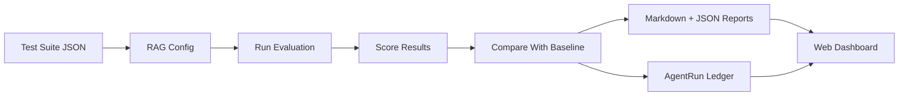
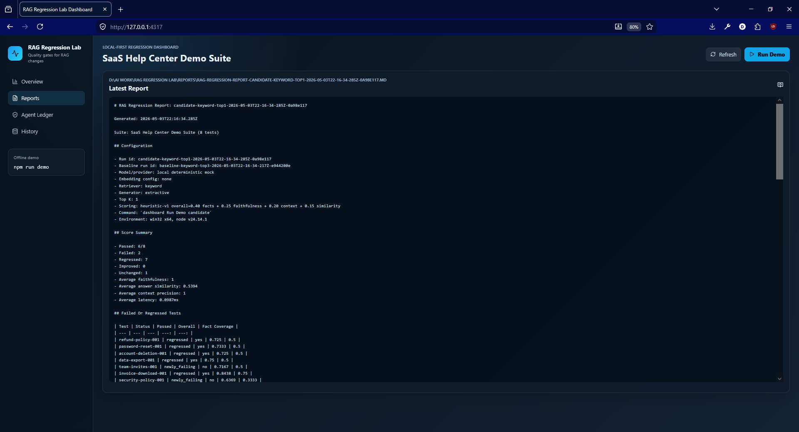

# RAG Regression Lab

RAG Regression Lab is a local-first evaluation harness for RAG apps. It lets you run the same question set against different retrieval/generation configs, score the outputs, detect regressions, and export reports that humans and AI agents can both understand.

RAG apps often break silently. A prompt, chunking, embedding, or retrieval change can improve one answer and damage another. This project makes those quality changes visible before they reach users.

## Features

- Demo SaaS help-center suite with 8 golden test cases.
- Deterministic offline RAG runner: keyword retrieval plus extractive generation.
- Transparent heuristic metrics: expected fact coverage, faithfulness, context precision, answer similarity, and weighted overall score.
- Baseline-vs-candidate comparison with regression, improvement, newly failing, and newly passing statuses.
- Markdown and JSON report export.
- AgentRun Ledger output for agent-readable recovery after resets.
- Material-inspired dark dashboard for latest runs, regression details, reports, ledger content, and historical runs.
- CI-friendly regression gate with environment-configurable thresholds.
- Provider config shape for offline, OpenAI, and Groq modes; offline remains the working default.
- Vitest coverage for core loading, retrieval, scoring, comparison, reports, and ledger writing.

## Architecture



## Quick Start

```bash
npm install
npm run demo
npm run dashboard:build
npm run dashboard
```

On Windows PowerShell with restricted script execution, use `npm.cmd`:

```powershell
npm.cmd install
npm.cmd run demo
npm.cmd run dashboard:build
npm.cmd run dashboard
```

The demo command loads `data/demo-suite.json`, runs a baseline config with `top_k=3`, runs a candidate config with `top_k=1`, compares them, writes reports, and updates the AgentRun Ledger.

Open the dashboard at `http://127.0.0.1:4317` after `npm run dashboard` starts.

## CLI Commands

```bash
npm run seed
npm run rag:run
npm run rag:compare -- --baseline <baseline.json> --candidate <candidate.json>
npm run rag:report -- --run <run.json>
npm run test
npm run lint
npm run build
npm run demo
npm run dashboard
npm run dashboard:build
npm run dev
npm run ci:rag
```

## Dashboard

The dashboard turns the CLI artifacts into a visual product surface. It shows the latest run id, suite name, timestamp, pass/fail counts, regression count, improvements, average score, baseline/candidate config, report path, and ledger path.

It includes:

- Regression table with baseline score, candidate score, delta, status badges, pass/fail badges, tags, and clickable rows.
- Test detail panel with expected facts, generated answer, retrieved context snippets, baseline/candidate metric breakdown, tags, difficulty, and a regression explanation.
- Report viewer for the latest Markdown report.
- AgentRun Ledger viewer for `latest-run.md` and `recovery-context.md`.
- Historical run list from `reports/` and `agentrun-ledger/runs/`.
- Refresh button and Run Demo button backed by the local dashboard API.


## 📊 Example Dashboard



## Running The Dashboard

Build the dashboard and start the local server:

```bash
npm run dashboard:build
npm run dashboard
```

For frontend development, run the API server and Vite dev server in separate terminals:

```bash
npm run dashboard
npm run dev
```

Vite serves the UI on `http://127.0.0.1:5173` and proxies `/api` requests to `http://127.0.0.1:4317`.

## Sample Output

```text
RAG Regression Lab demo complete.
Run: candidate-keyword-top1-...
Suite: SaaS Help Center Demo Suite
Passed: 6/8
Failed: 2
Regressed: 7
Improved: 0
Report: reports/rag-regression-report-<run_id>.md
Ledger markdown: agentrun-ledger/latest-run.md
```

The candidate intentionally retrieves fewer snippets, so it can miss facts that are spread across documents. The regression report is produced by the scoring logic rather than by hardcoded failures.

## CI Regression Gate

`npm run ci:rag` reads the latest generated run and fails when thresholds are exceeded. Defaults are demo-friendly because the built-in demo intentionally creates regressions:

```text
RAG_MAX_REGRESSIONS=10
RAG_MIN_AVERAGE_OVERALL=0.72
RAG_MAX_NEWLY_FAILING=2
```

Use stricter thresholds in CI:

```bash
RAG_MAX_REGRESSIONS=0 RAG_MIN_AVERAGE_OVERALL=0.80 RAG_MAX_NEWLY_FAILING=0 npm run ci:rag
```

On Windows PowerShell:

```powershell
$env:RAG_MAX_REGRESSIONS="0"
$env:RAG_MIN_AVERAGE_OVERALL="0.80"
$env:RAG_MAX_NEWLY_FAILING="0"
npm.cmd run ci:rag
```

## Provider Modes

The default provider is `offline`, which uses deterministic keyword retrieval and extractive generation. This mode requires no API keys and powers the demo.

Example config:

```json
{
  "provider": "offline",
  "model": "mock-extractive",
  "retriever": "keyword",
  "generator": "extractive",
  "topK": 3
}
```

Supported provider names are:

- `offline`: implemented and used by default.
- `openai`: config validation stub; requires `OPENAI_API_KEY` when selected.
- `groq`: config validation stub; requires `GROQ_API_KEY` when selected.

Real provider calls are intentionally not faked. The provider interface is ready for a future adapter, while the offline demo remains fully working.

## How Scoring Works

Text is normalized by lowercasing, removing punctuation, collapsing whitespace, and dropping common stopwords for token overlap. Metrics are deterministic and bounded between 0 and 1.

- `expectedFactCoverage`: average expected fact coverage in the generated answer, with exact normalized phrase matches or token-overlap credit.
- `contextPrecision`: share of retrieved snippets that contain or strongly overlap with expected facts.
- `faithfulness`: share of answer claims supported by retrieved context.
- `answerSimilarity`: token overlap between expected facts and generated answer.
- `overallScore`: `0.40 * expectedFactCoverage + 0.25 * faithfulness + 0.20 * contextPrecision + 0.15 * answerSimilarity`.

A candidate test regresses when its overall score is more than `0.10` below the baseline. Passing uses a default overall threshold of `0.72`.

## AgentRun Ledger

Every demo run updates:

- `agentrun-ledger/latest-run.md`
- `agentrun-ledger/latest-run.json`
- `agentrun-ledger/recovery-context.md`
- `agentrun-ledger/runs/<run_id>.md`
- `agentrun-ledger/runs/<run_id>.json`

The JSON file is machine-readable and includes run metadata, config details, per-test retrieved context, generated answer, scores, pass/fail status, regression status, and summary metrics. The Markdown file is designed for humans. The recovery context tells a future agent what was built, what commands passed or failed, known issues, important files, and how to continue.

## AgentRun Ledger Viewer

The dashboard includes an AgentRun Ledger section that shows the latest ledger report, recovery context, generated file paths, and validation commands. This is designed so a future AI coding agent can recover the project state without asking for a replay of the work.

## Reports

Reports are written to:

```text
reports/rag-regression-report-<run_id>.md
reports/rag-regression-report-<run_id>.json
```

Generated report files are ignored by git to keep the repo clean, while `.gitkeep` files preserve the directories.

## Project Structure

```text
data/demo-suite.json              Demo golden test suite
src/cli/index.ts                  CLI entrypoint
src/core/                         RAG runner, metrics, comparison, reports
src/ci/ragGate.ts                 CI regression gate
src/dashboard/                    React dashboard and data adapter
src/demo/runDemo.ts               Full offline demo pipeline
src/ledger/agentRunLedger.ts      AgentRun Ledger integration
src/server/dashboardServer.ts     Express dashboard server and local API
tests/                            Vitest test suite
reports/                          Generated reports
agentrun-ledger/                  Latest run and recovery context
```

## Recovery After Agent Reset

1. Read `rag-regression-lab-codex-task.md`.
2. Read `agentrun-ledger/recovery-context.md`.
3. Inspect `agentrun-ledger/latest-run.md` and `agentrun-ledger/latest-run.json`.
4. Run `npm.cmd run test`, `npm.cmd run build`, `npm.cmd run dashboard:build`, `npm.cmd run demo`, and `npm.cmd run ci:rag`.
5. Continue from the first failing command or incomplete requirement.

## Roadmap

- Add SQLite persistence for historical run search.
- Add real OpenAI/Groq provider adapters behind the offline default.
- Add per-tag score trend reports.
- Add CI workflow examples for regression gates.
